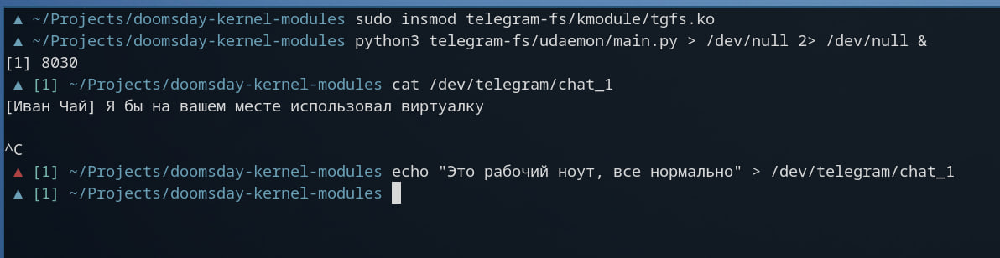
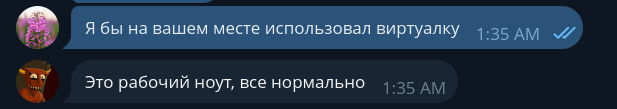

### Telegram kernel-space client

Kernel-space клиент телеграмма?! 

Модуль состоит из kernel-space драйвера character device и user-space демона. Демон поднимает общается с модулем через charracter device /dev/telegram/bus?
По сути сделал pipe в kernel-space и радуется

#### Сборка и подключение модуля

    cd kmodule
    make

Подключаем

    sudo insmod tgfs.ko

Убираем, пока никто не заметил

    sudo rmmod tgfs

#### Запуск user-space демона

Поправим `udaemon/config.py`. Надо добавить маппинг id чатов и токен tg бота

    cd udaemon
    python3 -m venv venv
    source venv/bin/activate
    pip3 install -r requirements.txt
    python3 main.py

#### Использование

1. Собрать и подключить модуль
2. Настроить и запустить user-space демон

Список чатов:

    ls /dev/telegram/

Прочитать чат:

    cat /dev/telegram/chat_1

Отправить сообщение

    echo "message" > /dev/telegram/chat_1
